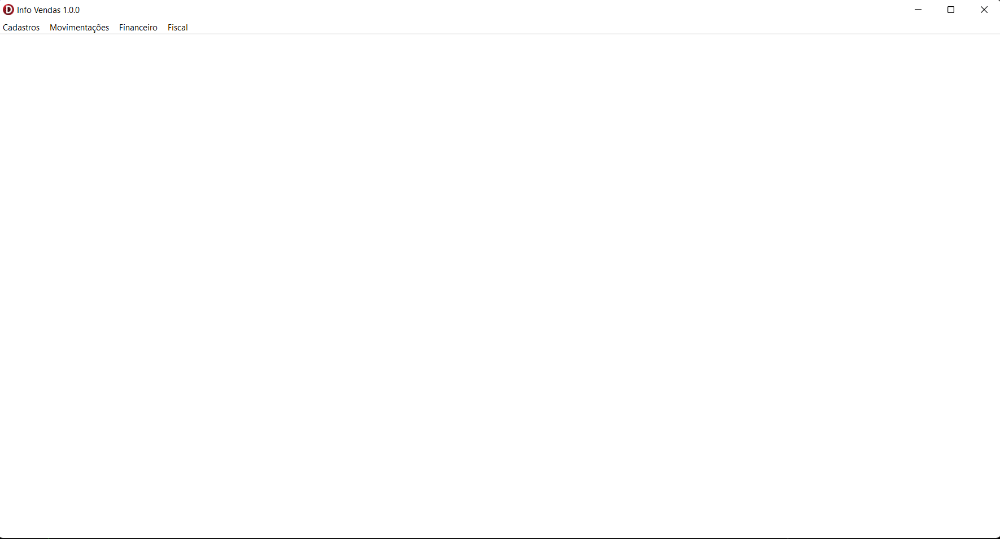
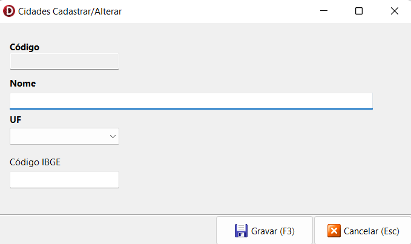
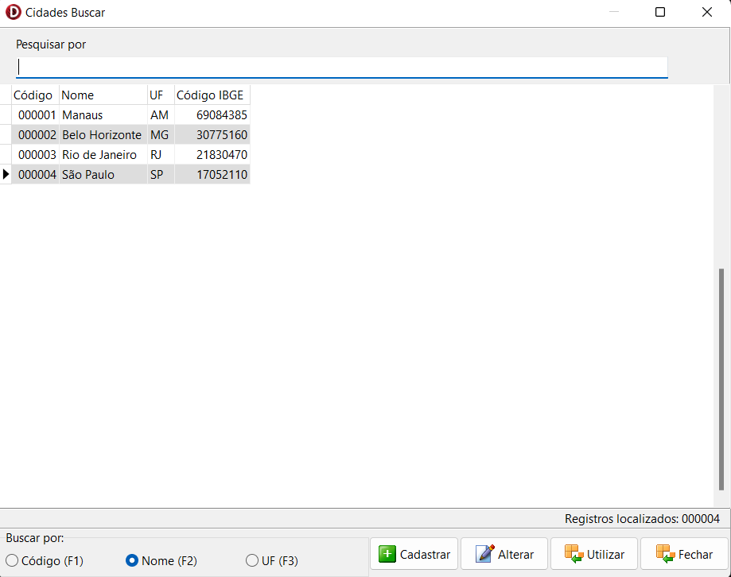
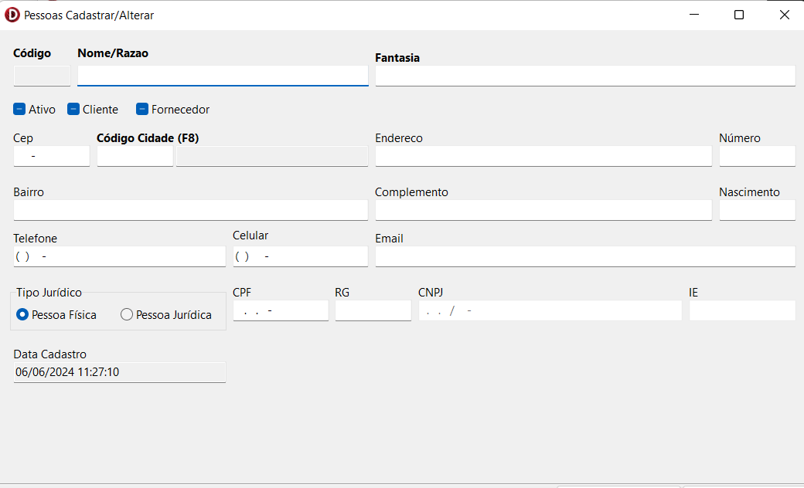
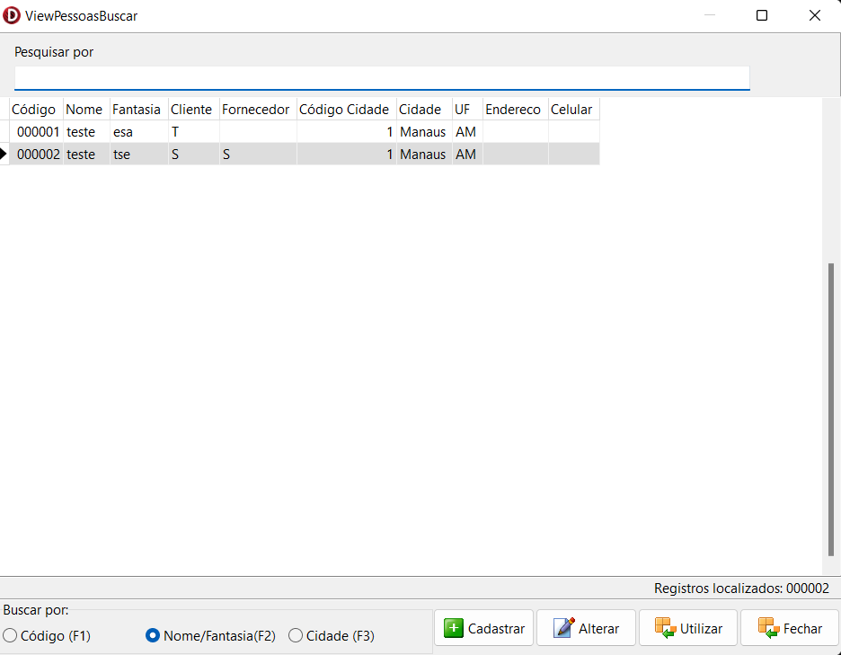
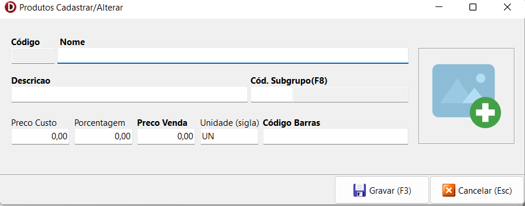
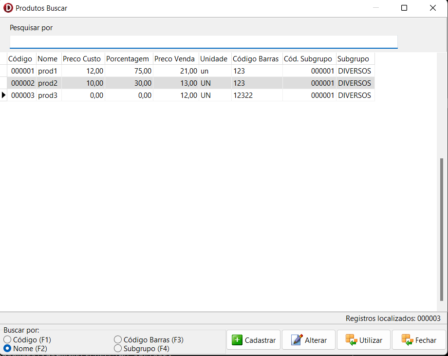
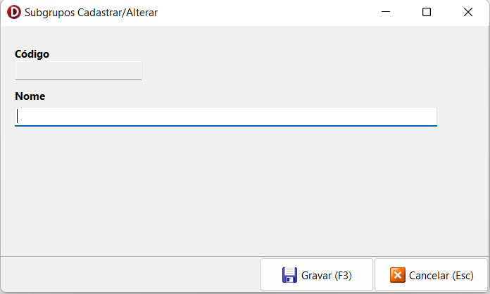
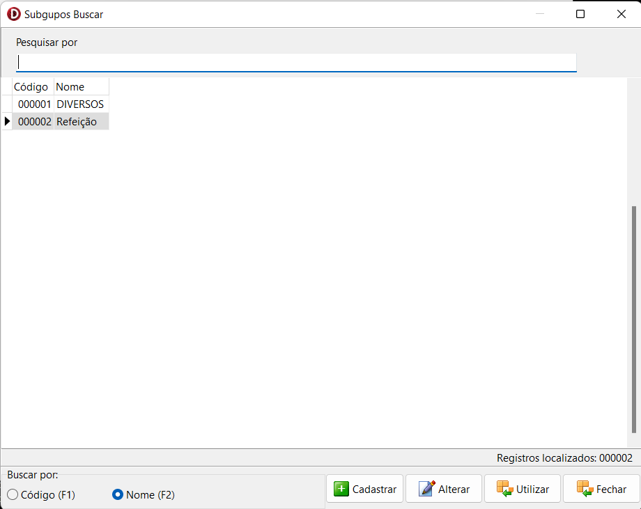
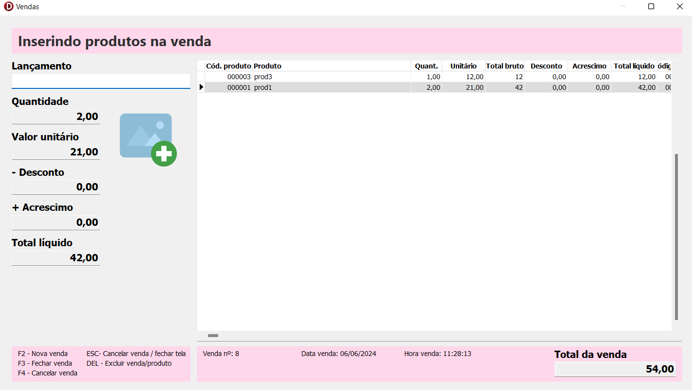

# Info Vendas

Este é um projeto desenvolvido em Delphi 11 e base Firebird. o Objetivo deste projeto é construir um sistema de vendas em Delphi em multicamadas.

## Ambiente de Desenvolvimento

Para execucão do projeto local:

1. Ter o Delphi e Firebird instalados em seu ambiente
2. Clone este repositório em sua máquina local.
3. No diretório raiz do projeto, abra a IDE e execute o projeto no play ou no comando:

```
ctrl + shift + F9
```

4. A aplicação abrirá a tela home.

## Funcionalidades

1. **Tela Inicial**: Primeira tela ao iniciar a aplicação



2. **Tela Cidades Cadastro**: Tela de cadastro de cidades



3. **Tela Cidades Buscar**: Tela de busca de cidades



4. **Tela Pessoas Cadastro**: Tela de cadastro de pessoas



5. **Tela Pessoas Buscar**: Tela de busca de pessoas



6. **Tela Produtos Cadastrar**: Tela de cadastro de produtos



7. **Tela Produtos Buscar**: Tela de busca de produtos



8. **Tela Subgrupos Cadastrar**: Tela de cadastro de subgrupos



9. **Tela Subgrupos Buscar**: Tela de busca de subgrupos



10. **Tela de Vendas**: Tela de vendas 




## Estrutura do Projeto

O projeto tem a seguinte estrutura:

- **bin/**: Contém os arquivos de build do projeto.
- **dados/**: Contém os arquivos de dados do projeto.
- **dcu/**: Contém os arquivos de temporários do projeto.
- **img/**: Contém as imagens utilizadas no projeto.
- **src/**: Contém todo o core do projeto como models, views, utils, RTTI e exceptions

## Dependências Externas

Este projeto utiliza as seguintes dependências externas:

- **Firebird**: Banco de dados utilizado.
- **IbExpert**: Gerenciador de banco de dados utilizado.
